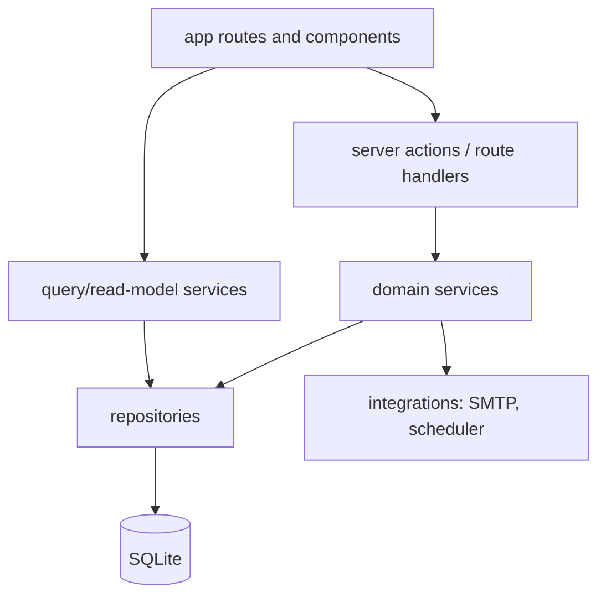
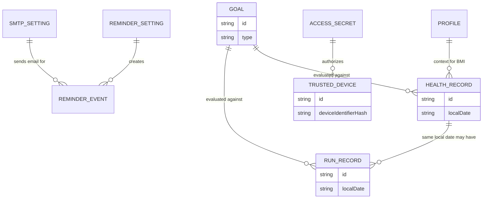
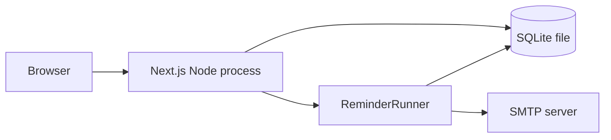

# 瘦身助手架构 Spine

## Design Paradigm

瘦身助手采用**分层功能切片的模块化单体**。



目录和依赖方向：

- `app/` 只负责路由、页面组合和调用 server actions / route handlers。
- `features/*/components/` 只负责该功能的界面组件。
- `features/*/actions/` 是页面进入服务层的写入入口。
- `features/*/services/` 拥有业务规则、计算和状态变更。
- `features/*/repositories/` 拥有持久化读写。
- `db/` 拥有 schema、migration 和数据库连接。
- `integrations/` 拥有 SMTP、提醒运行器等外部或进程级能力。

## Invariants & Rules

### AD-1 — 模块化单体与依赖方向

- **Binds:** FR-1..FR-18, all implementation stories
- **Prevents:** 页面、API、调度器分别实现业务规则，导致同一能力出现不同行为。
- **Rule:** 所有写入从 `app/` 进入 `features/*/actions/` 或 route handler，再进入 `features/*/services/`。UI、route handler、scheduler 不得直接写数据库。

### AD-2 — 单一本地 SQLite 持久化边界

- **Binds:** 健康记录、跑步记录、目标、提醒、设置、访问保护
- **Prevents:** 不同功能各自定义数据形状，或把配置散落到环境变量、浏览器存储和本地文件。
- **Rule:** MVP 使用一个本地 SQLite 数据库。应用代码只能通过 Drizzle repository 访问数据库；禁止在 UI、server action 和 scheduler 中散落 SQL。

### AD-3 — 派生数据不作为权威事实存储

- **Binds:** BMI、趋势反馈、目标进度、周汇总、预计达成时间、今日状态
- **Prevents:** 编辑或删除记录后，首页和历史页展示旧的 BMI、进度、趋势或预计时间。
- **Rule:** 数据库只存源事实和配置。BMI、趋势、周汇总、目标差距、预计达成时间由 query/read-model service 按需计算。若未来增加缓存，缓存必须能由源事实完全重建。

### AD-4 — 访问保护是设备信任，不是账号系统

- **Binds:** FR-18, settings, protected routes
- **Prevents:** 实现阶段引入注册、多用户、角色权限，或只做客户端保护导致数据暴露。
- **Rule:** 服务器本地保存访问密码哈希和受信设备记录。未受信浏览器必须先通过访问密码验证；验证后浏览器生成随机设备标识并存入 cookie 或 localStorage，服务器把该标识记录为受信设备。所有读取和写入个人数据的 server entrypoint 都必须校验受信设备。

### AD-5 — 提醒由单一 ReminderRunner 决策

- **Binds:** FR-12..FR-14, reminder state, email reminders
- **Prevents:** 首页、设置页和后台任务分别判断提醒条件，产生重复提醒或漏发邮件。
- **Rule:** 提醒条件只由 `ReminderRunner` 调用提醒服务计算。它从 SQLite 读取提醒设置和最新记录，创建站内提醒，并在邮件提醒启用且 SMTP 有效时通过 Nodemailer 发送邮件。页面只展示提醒状态，不重新判定发送资格。

### AD-6 — 配置全部从设置模型读取

- **Binds:** FR-15..FR-17, SMTP, trend thresholds, profile, trusted devices
- **Prevents:** 设置页修改后，提醒、趋势估算或 SMTP 发送仍使用旧的环境变量或硬编码值。
- **Rule:** 用户可配置项必须落在 typed settings model 中：个人资料、SMTP、趋势估算阈值、提醒规则、访问密码元数据、受信设备。环境变量只允许用于部署级路径和非用户可编辑默认值。

### AD-7 — UI 必须继承 final UX spine

- **Binds:** all user-facing UI
- **Prevents:** 英文界面、营销式首页、临时组件风格和与 UX 不一致的页面结构。
- **Rule:** 可见 UI 文案使用中文，显示名为“瘦身助手”。页面、状态、组件行为遵守 `EXPERIENCE.md`；颜色、圆角、布局密度和组件视觉遵守 `DESIGN.md`。`mockups/key-screens.html` 是布局参考，spine 文档冲突时优先。

### AD-8 — 部署目标是长运行 Node 进程

- **Binds:** persistence, reminders, access password, trusted devices, SMTP
- **Prevents:** 选择 serverless/edge 部署导致本地 SQLite、进程内提醒、服务器本地密码和受信设备状态不可用。
- **Rule:** MVP 运行在一个长运行 Node.js 进程中，并拥有本地文件系统写权限。数据目录必须可持久化备份。不要把 MVP 部署到无持久磁盘或无常驻进程的 serverless/edge 环境。

### AD-9 — 核心数据不变量

- **Binds:** FR-1..FR-18, database schema, repositories, read models
- **Prevents:** 记录、目标、提醒、设置模块各自解释实体基数，导致覆盖规则、提醒去重和目标计算不一致。
- **Rule:** `healthRecord` 对 `localDate` 唯一；`runRecord` 对同一 `localDate` 允许多条；`goal` 是按类型区分的目标记录；`setting` 是按 key/type 区分的单例配置；`reminderEvent` 必须按 `localDate + reminderType + channel` 幂等，避免同一天同渠道重复提醒。

## Consistency Conventions

| Concern | Convention |
| --- | --- |
| 命名 | 数据实体用英文代码名：`healthRecord`, `runRecord`, `goal`, `reminder`, `setting`, `trustedDevice`；界面显示中文。 |
| ID | 数据库主键使用字符串 UUID。URL 和 server actions 不暴露自增序列。 |
| 日期 | 记录按用户本地日期归属，日期字段保存 `YYYY-MM-DD`；时间戳保存 ISO 字符串。 |
| 单位 | 体重 kg、距离 km、围度 cm、心率 bpm、步幅 m、步频 spm、配速秒/公里作为内部数值，界面格式化为中文单位。 |
| 错误 | service 返回 typed result；UI 展示中文错误。底层错误不直接暴露到页面。 |
| 表单校验 | server 端校验是权威；client 端校验只用于即时反馈。 |
| 敏感值 | 访问密码和 SMTP 密码/授权码不得明文回显；访问密码必须哈希保存。 |
| 派生计算 | BMI、配速、趋势、预计达成时间在 service/read-model 中集中实现。 |
| 可访问性 | 图表必须有文字摘要；颜色不能作为唯一信息来源。 |

## Stack

| Name | Version |
| --- | --- |
| Node.js | 24.18.0 LTS |
| Next.js | 16.2.9 |
| React | 19.2 |
| TypeScript | 6.0.3 |
| Tailwind CSS | 4.3.1 |
| shadcn/ui CLI | v4 / `shadcn@latest` |
| Drizzle ORM | 0.45.2 |
| Drizzle Kit | 0.31.10 |
| better-sqlite3 | 12.11.1 |
| Nodemailer | 9.0.1 |
| SQLite | bundled through better-sqlite3 |

## Structural Seed

```text
SlimmingAssistant/
  app/
    (protected)/              # 受信设备验证后的主要页面
    access/                   # 访问密码创建/验证
    api/                      # 必要 route handlers: reminder test, SMTP test, device trust
  components/
    ui/                       # shadcn/ui 组件
    layout/                   # 导航、页面框架
  features/
    records/
      components/
      actions/
      services/
      repositories/
    goals/
      components/
      actions/
      services/
      repositories/
    dashboard/
      components/
      services/               # read models: today status, trends, goal progress
    reminders/
      components/
      actions/
      services/
      repositories/
    settings/
      components/
      actions/
      services/
      repositories/
    access/
      components/
      actions/
      services/
      repositories/
  db/
    schema.ts
    migrations/
    client.ts
  integrations/
    reminder-runner.ts
    mailer.ts
  lib/
    dates.ts
    units.ts
    result.ts
    validation.ts
```

Core entities:



Runtime shape:



## Capability → Architecture Map

| Capability / Area | Lives in | Governed by |
| --- | --- | --- |
| FR-1 创建/覆盖健康记录 | `features/records` | AD-1, AD-2, AD-3, AD-9 |
| FR-2 创建跑步记录 | `features/records` | AD-1, AD-2, AD-3, AD-9 |
| FR-3 查看/编辑/删除记录 | `features/records`, `features/dashboard` | AD-1, AD-3 |
| FR-4..FR-6 目标设置和状态 | `features/goals`, `features/dashboard` | AD-1, AD-2, AD-3 |
| FR-7..FR-11 首页、趋势、预计时间、鼓励文案 | `features/dashboard` | AD-3, AD-7 |
| FR-12..FR-14 提醒和邮件 | `features/reminders`, `integrations/reminder-runner.ts`, `integrations/mailer.ts` | AD-5, AD-6, AD-8, AD-9 |
| FR-15 个人资料 | `features/settings` | AD-6 |
| FR-16 SMTP 配置 | `features/settings`, `integrations/mailer.ts` | AD-6 |
| FR-17 趋势阈值 | `features/settings`, `features/dashboard` | AD-3, AD-6 |
| FR-18 访问保护 | `features/access`, protected route boundary | AD-4, AD-8 |
| 中文简洁 UI | `app/`, `features/*/components`, `components/ui` | AD-7 |

## Deferred

| Decision | Why deferred |
| --- | --- |
| 具体部署介质：本机、NAS、VPS、Docker Compose | AD-8 已固定长运行 Node + 持久磁盘；具体载体可在实现/部署故事中选择。 |
| 图表库 | UX 只要求简单图表和文字摘要；具体库可由实现阶段按 Next.js 兼容性选择。 |
| SMTP 密码加密方式 | AD-6/AD-7 已要求不明文回显；是否用本地密钥加密可在安全实现故事中确定。 |
| 备份策略 | AD-8 要求数据目录可备份；备份频率和介质可在运维故事中确定。 |
| 未来第三方数据导入 | PRD 明确非 MVP；不进入当前架构 spine。 |
