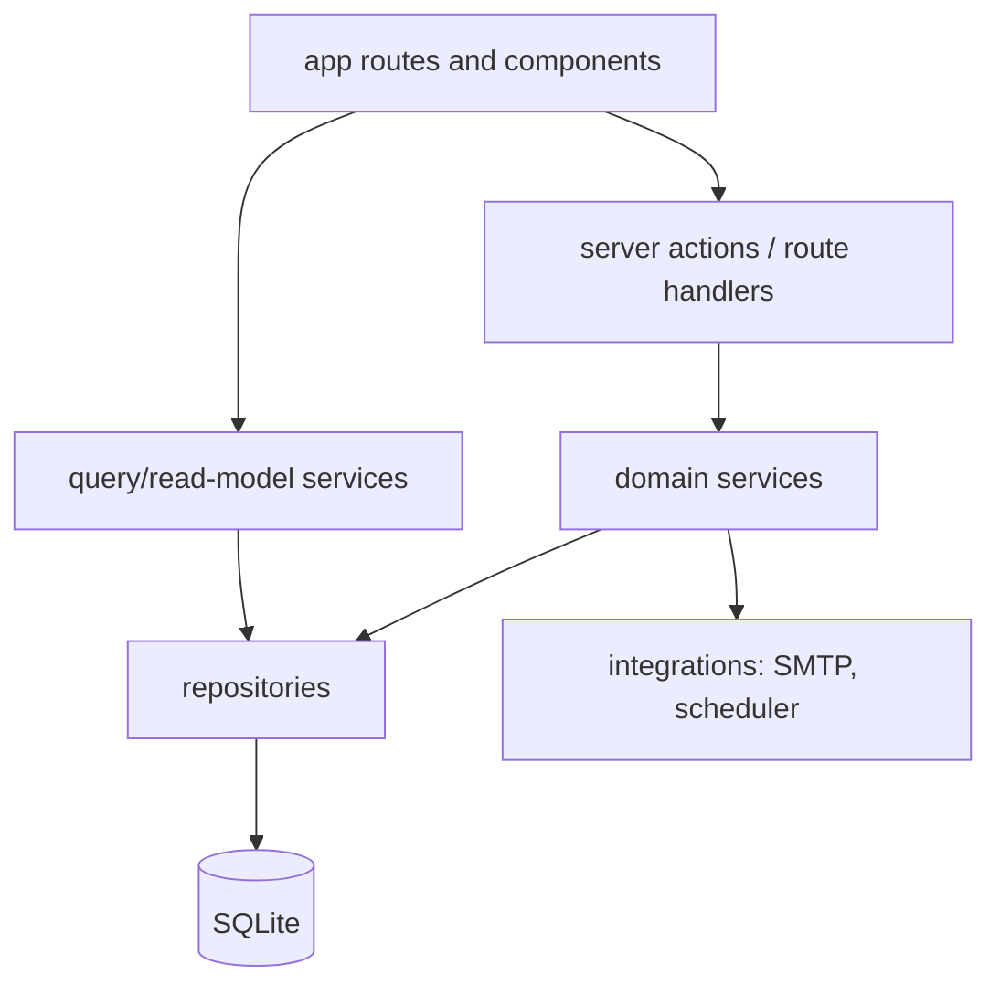
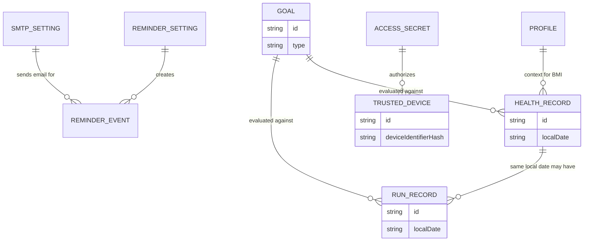
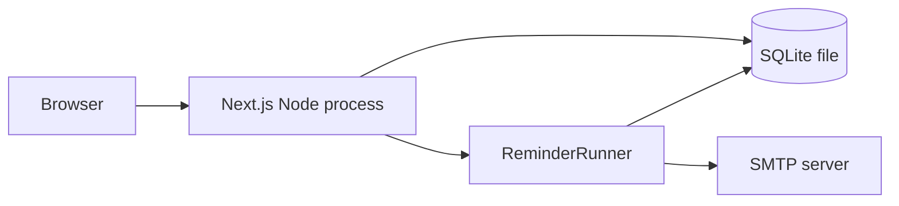

# 架构图

## 依赖方向

```mermaid
flowchart TD
  UI[app routes and components] --> Actions[server actions / route handlers]
  Actions --> Services[domain services]
  Services --> Repositories[repositories]
  Repositories --> DB[(SQLite)]
  Services --> Integrations[integrations: SMTP, scheduler]
  UI --> ReadModels[query/read-model services]
  ReadModels --> Repositories
```

## 核心实体

```mermaid
erDiagram
  HEALTH_RECORD ||--o{ RUN_RECORD : "same local date may have"
  PROFILE ||--o{ HEALTH_RECORD : "context for BMI"
  GOAL ||--o{ HEALTH_RECORD : "evaluated against"
  GOAL ||--o{ RUN_RECORD : "evaluated against"
  REMINDER_SETTING ||--o{ REMINDER_EVENT : "creates"
  SMTP_SETTING ||--o{ REMINDER_EVENT : "sends email for"
  ACCESS_SECRET ||--o{ TRUSTED_DEVICE : "authorizes"

  HEALTH_RECORD {
    string id
    string localDate
  }
  RUN_RECORD {
    string id
    string localDate
  }
  GOAL {
    string id
    string type
  }
  TRUSTED_DEVICE {
    string id
    string deviceIdentifierHash
  }
```

## 运行形态

```mermaid
flowchart LR
  Browser[Browser] --> Next[Next.js Node process]
  Next --> SQLite[(SQLite file)]
  Next --> Runner[ReminderRunner]
  Runner --> SQLite
  Runner --> SMTP[SMTP server]
```

